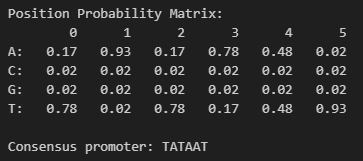
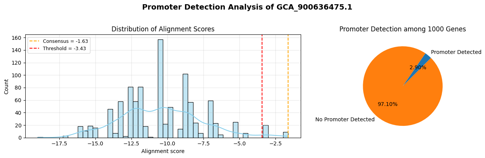

# Gene Promoter Analysis

A comprehensive computational biology project for identifying and analyzing bacterial gene promoters using Position Probability Matrices (PPM) and statistical alignment methods.

## 📋 Project Overview

This project implements a computational pipeline to:
1. **Construct Position Probability Matrices (PPM)** from known promoter sequences
2. **Perform statistical alignment** to detect promoter regions across multiple bacterial genomes
3. **Analyze and visualize** promoter detection results across different bacterial strains

The analysis focuses on identifying the canonical bacterial promoter motif **TATAAT** (Pribnow box) and its variants across multiple *Streptococcus pneumoniae* genomes.

## 🧬 Methodology

### 1. Position Probability Matrix (PPM) Construction
- Selected 100 random genes from the reference genome (`GCA_900636475.1`)
- Applied promoter finder algorithm to detect **WAWWWT** motif patterns (W = A or T)
- Constructed PPM using 6 detected promoter sequences with pseudocount normalization (0.15)
- Generated consensus sequence: **TATAAT**



### 2. Statistical Alignment
- Extracted 1,000 additional promoter regions from the reference genome
- Calculated alignment scores using log-likelihood approach
- Applied threshold-based filtering (consensus score - 1.8)
- Detected **29 promoters** out of 1,000 regions (2.9%)



### 3. Cross-Genome Validation
Applied the constructed PPM to analyze promoter presence in 5 additional *S. pneumoniae* strains:

| Genome ID | Promoters Detected |
|-----------|-------------------|
| GCA_001457635.1 | 36 |
| GCA_019048645.1 | Results vary |
| GCA_900637025.1 | Results vary |
| GCA_900475505.1 | Results vary |
| GCA_019046945.1 | Results vary |

### Sample Analysis Results

<table>
<tr>
<td></td>
<td></td>
</tr>
<tr>
<td></td>
<td></td>
</tr>
</table>

## 🚀 Setup Instructions

### Prerequisites
- Python 3.8+
- Conda/Miniconda
- Git

### Environment Setup

1. **Clone the repository**
```bash
git clone <repository-url>
cd gene-promoter-analysis
```

2. **Create and activate conda environment**
```bash
# Create environment from environment.yml (includes all dependencies)
conda env create -f environment.yml

# Activate the environment
conda activate gsp_ncbi
```

> **Note**: The `environment.yml` file contains all required packages including:
> - BioPython, pandas, numpy for data processing
> - matplotlib, seaborn, logomaker for visualizations
> - gffutils for genome annotation parsing
> - NCBI datasets CLI for genome downloads

### Data Acquisition

**Download genome data using the provided script:**
```bash
cd scripts
bash download_genomes.sh
```

This will download the following *Streptococcus pneumoniae* genomes:
- GCA_001457635.1
- GCA_019048645.1
- GCA_900636475.1 (Reference genome)
- GCA_900637025.1
- GCA_900475505.1
- GCA_019046945.1

## 📊 Usage

### Running the Analysis

1. **Configure analysis parameters**
   Edit `config.yaml` to set:
   - Data path
   - Reference genome ID

2. **Execute the Jupyter notebook**
```bash
jupyter notebook promoter_analysis.ipynb
```

The notebook is organized into three main sections:
- **Section 1**: PPM Construction
- **Section 2**: Statistical Alignment (1,000 regions)
- **Section 3**: Cross-genome promoter search

### Key Classes and Functions

#### `GenomeManager`
Manages genome file operations and promoter extraction:
- `read_fna()`: Load FASTA genome sequences
- `load_gff()`: Parse GFF annotation files
- `extract_promoter_regions()`: Extract upstream regions (15-5 bp before TSS)

#### `find_promoter()`
Identifies promoter sequences matching the WAWWWT pattern

#### `alignment_score()`
Calculates log-likelihood alignment scores for promoter detection

## 🔍 Key Results

### PPM Characteristics
```
Position:    0      1      2      3      4      5
A:        0.17   0.93   0.17   0.78   0.48   0.02
C:        0.02   0.02   0.02   0.02   0.02   0.02
G:        0.02   0.02   0.02   0.02   0.02   0.02
T:        0.78   0.02   0.78   0.17   0.48   0.93
```

### Detection Statistics
- **Consensus promoter score**: -1.63
- **Threshold value**: -3.43
- **Detection rate**: ~3% of analyzed regions
- **Common variants**: TATAAT, TATATT, TATTTT, TAAAAT

## 📁 Project Structure

```
gene-promoter-analysis/
├── README.md                          # This file
├── environment.yml                    # Conda environment specification
├── promoter_analysis.ipynb           # Main analysis notebook
├── promoter_analysis_report.pdf      # Detailed analysis report
├── config.yaml                        # Configuration file
├── genome_accessions.txt             # List of genome IDs
├── data/                             # Genome data (not in repo)
│   └── ncbi_dataset/
│       └── data/
│           ├── GCA_900636475.1/      # Reference genome
│           └── ...                    # Other genomes
├── images/                           # Analysis visualizations
│   ├── ppm.png                       # Position Probability Matrix
│   ├── ref_genome.png                # Reference genome results
│   ├── motif.png                     # Sequence logo
│   └── genome_*.png                  # Individual genome results
└── scripts/                          # Setup and utility scripts
    └── download_genomes.sh           # Genome download script
```

## 🧪 Algorithm Details

### Promoter Pattern Recognition
The promoter finder uses a template-based approach:
- **Template**: WAWWWT (W = A or T)
- **Search direction**: 3' to 5' (upstream from gene start)
- **Match criteria**: Exact nucleotide matching per position

### Statistical Scoring
Alignment score calculation:
```python
score = ∏(PPM[nucleotide][position])
log_score = ln(score)
```

Promoters are detected when:
```
log_score ≥ consensus_score - threshold
```

## 📚 References

For detailed methodology and results, see:
- `promoter_analysis_report.pdf` - Complete analysis report
- `promoter_analysis.ipynb` - Interactive analysis notebook

## 🤝 Contributing

Contributions are welcome! Please feel free to submit issues or pull requests.

## 📄 License

This project is for educational and research purposes.

## 👨‍💻 Authors

Created as part of bioinformatics coursework for gene promoter analysis.

---

**Last Updated**: January 2026
